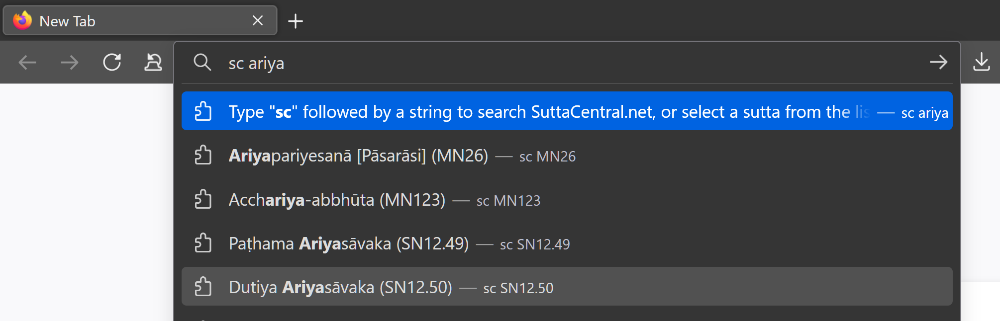
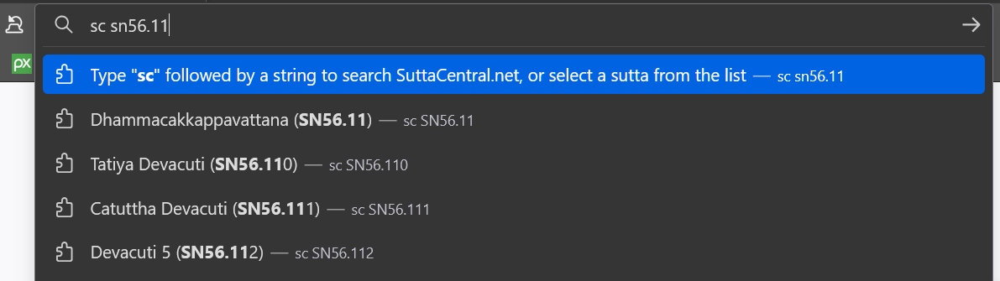
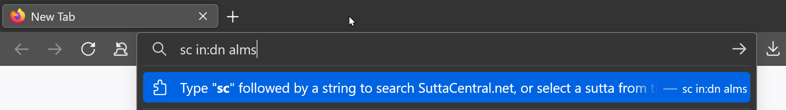
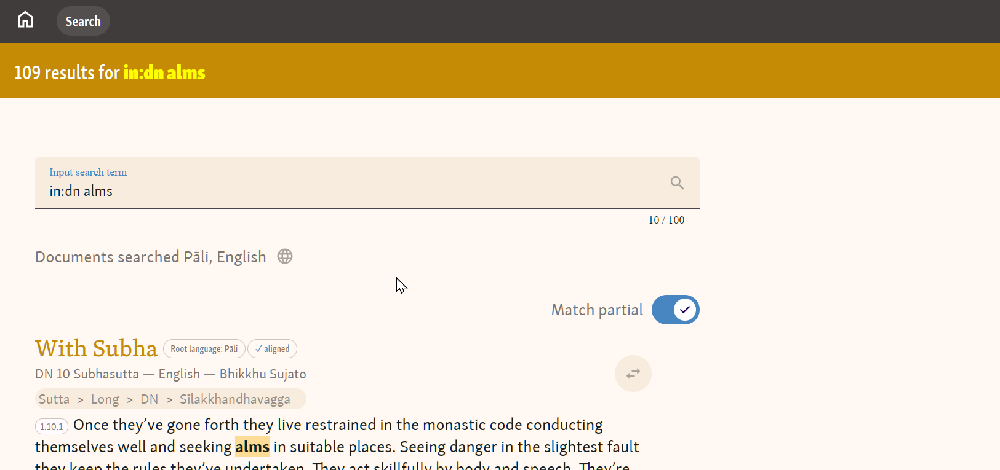

# SuttaCentral Omnibox support

## What it does

This extension allows you to lookup up suttas or search SuttaCentral using the awesome bar.

To test it out, type 'sc' into the awesome bar followed by a search string (e.g. `cs almsbowl`). Hitting enter will search open the SuttaCentral.net search page for `almsbowl`.

Or type 'sc' and a citation or name of a sutta. suggestions will appear.

## instalation from source

If you want to try out this unbunded version, you will need to download all the files to your desktop. The following video explains how to install in Chrome and Firefox:

[Install unpacked extension](https://www.youtube.com/watch?v=dhaGRJvJAII&t=53s)

## How to use

The following is how it will look in FireFox.

In the "omnibox" (aka url bar or search bar) type `sc ` and part of the title of a sutta:

Then arrow down or click on the sutta you want.

Or type a citation:

Or simply type a search string and press enter:

That will take you to the SuttaCentral.net results page:

